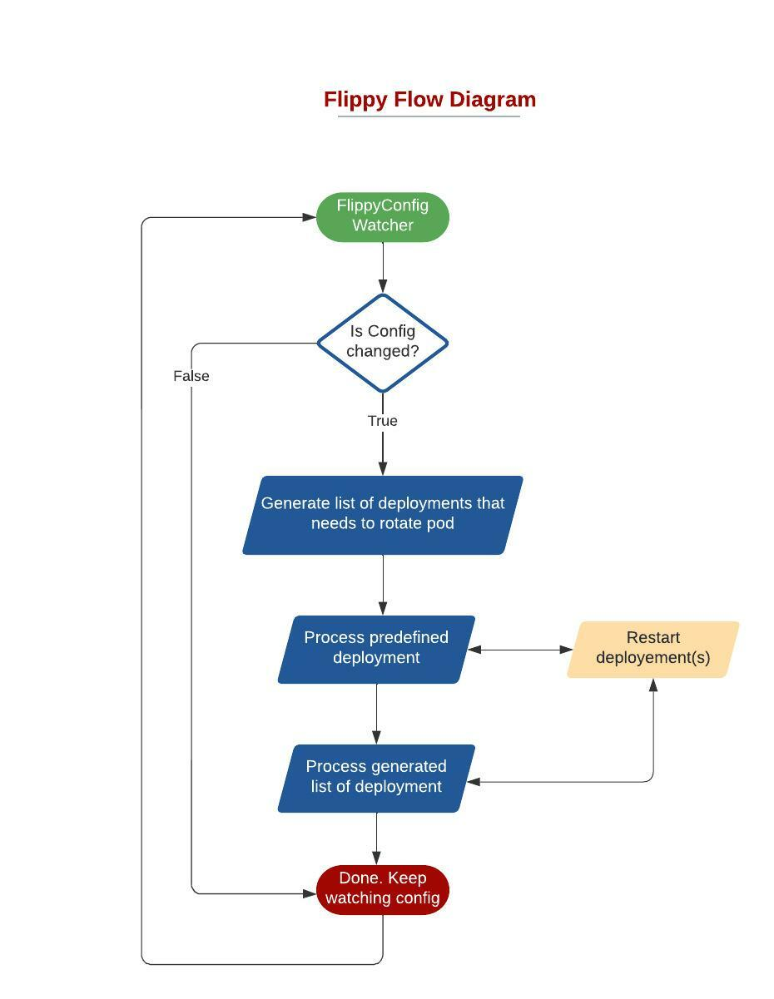

# Flippy Operator Flow


<HR>

### Description for Flippy Config

##### 1. ProcessFilter:
This section dictates condition(s) on which pod(s)/deployment(s) filtered across kubernetes cluster.<br>
Example -
```
  ProcessFilter:
    Containers:
      - istio-proxy
    Labels:
      "istio-injection": "enabled"
    Annotations:
      "sidecar.istio.io/inject": "true"
```
This will filter pod(s)/deployment(s) which  has container named `istio-proxy`, contains label `"istio-injection": "enabled"` and has annotation `"sidecar.istio.io/inject": "true"`
##### 2. ImageList
This section dictates desire docker image(s). Flippy will mark deployment(s)/pod(s) for restart if container image doesn't match to any thing from list for condition specified in [#1](#1-processfilter).<br>
Example -
  ```
  ImageList:
    - docker.intuit.com/flippy/sample:abc
    - docker.intuit.com/flippy/sample:pqr
  ```
##### 3. Preconditions:
This section dictates wait condition before processing any restart. <br>
Example -
  ```
  Preconditions:
    - K8S:
        Type: Deployment
        Name: istiod
        Namespace: istio-system
      StatusCheckConfig:
        CheckStatus: true
        MaxRetry: 10
        RetryDuration: 30
  ```
This will wait & check `istiod` deployment under `istio-system` to be healthy before proceeding any restart.
##### 4. PostFilterRestarts:
This section dictates action which needs to be performed before restarting any deployment(s) from generated list. <br>
Example -
  ```
  PostFilterRestarts:
    - K8S:
        Type: Deployment
        Name: istio-ingressgateway
        Namespace: istio-system
      StatusCheckConfig:
        CheckStatus: true
        MaxRetry: 10
        RetryDuration: 30
  ```
This will restart `istio-ingressgateway` deployment under `istio-system` namespace before processing any restart(s) from generated list.
##### 5. RestartObjects:
This section dictates which kubernetes object(s) need to be processed.<br>
Example -
  ```
  RestartObjects:
    - Type: Deployment
      StatusCheckConfig:
        CheckStatus: false
        MaxRetry: 10
        RetryDuration: 30
    - Type: ArgoRollout
      StatusCheckConfig:
        CheckStatus: false
        MaxRetry: 10
        RetryDuration: 30
  ```
This will watch all [Kubernetes Deployment](https://kubernetes.io/docs/concepts/workloads/controllers/deployment/) and [Argo Rollouts](https://argoproj.github.io/argo-rollouts/) which matches [#1](#1-processfilter) & [#2](#2-imagelist)

<hr>

**Feel free to refer [Sample Flippy Config](../sample/sample.yaml).**
