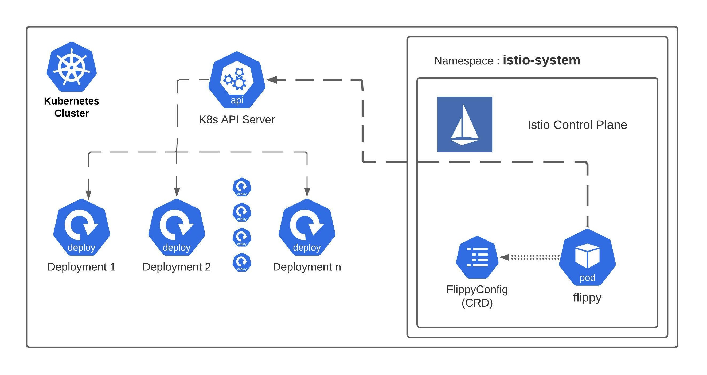

# Flippy

Flippy is a kubernetes operator which restarts deployments that are Service Mesh enabled if the sidecar container’s docker image doesn’t match the expected docker image. This is useful for forcing Istio data plane upgrades after a control plane upgrade if required.

# Why Flippy?

There are two parts for mesh, the control plane and the data plane. The control plane changes are rolled out as a part of the IKS2 Istio add-on, but data plane changes occur with pod restarts. New sidecar containers are installed at the time pods are created. The control plane dictates which docker image gets installed as a sidecar container, but the Istio control plane does not rotate data plane pods.

# How Flippy works?

**Flippy provides automatic restart capability to pods based on configuration like image name change**

Flippy monitors a CRD which stores the desired container image. As configmap value changes flippy operators get triggered. Flippy operators examine deployments which are mesh enabled. It restarts the mesh-injected deployments one by one asynchronously, which doesn’t block the kubernetes cluster upgrade process.
 
CRD have more wider filtering which can be used to solve more generic solutions instead of just istio/mesh targeted solutions.

### Demo

Flippy demoed in Service Mesh end-user community. Please feel free to [watch the demo](https://youtu.be/Ll68AF3NZjw).

We demoed the old version which was based upon [Kubernetes ConfigMap](https://kubernetes.io/docs/concepts/configuration/configmap/). We have improved over time and provided more advanced filters and support with [Kubernetes CRD-based](https://kubernetes.io/docs/tasks/access-kubernetes-api/extend-api-custom-resource-definitions) approach.

## [Docs](./Docs/index.md)

## Who uses Flippy?

Organizations below are **officially** using Flippy. Please send a PR with your organization name if you are using Flippy.

* [Intuit](https://www.intuit.com/)

## Contributing
Refer to [Contributing doc](./Docs/contributing.md)  
